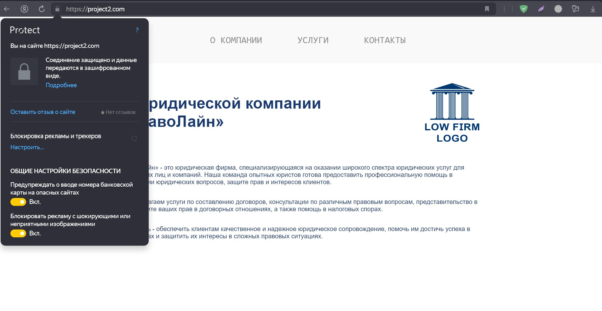

# Лабораторная работа №1: Настройка nginx

## Ход работы

### Установка nginx
На виртуальной машине Ubuntu устанавливаем nginx
```bash
maria@maria-vm:~$ nginx -v
nginx version: nginx/1.24.0 (Ubuntu)
```
### Создание сертификата
В директории ```/etc/nginx/ssl``` создаем самоподписанный сертификат
```bash
openssl req -x509 -nodes -newkey rsa:2048 -keyout /etc/nginx/ssl/nginx.key -out /etc/nginx/ssl/nginx.crt
```
```req``` Запрос на создание нового сертификата

```-new``` Создание запроса на сертификат (Certificate Signing Request – CSR)

```-x509``` Вместо создания CSR создать самоподписанный сертификат

```-nodes``` Не шифровать закрытый ключ

```-newkey rsa:2048``` Создать новую пару ключей: приватный и публичный

```-keyout /etc/nginx/ssl/nginx.key``` Закрытый ключ сохранить в файл nginx.key

```-out /etc/nginx/ssl/nginx.crt``` Сохранить самоподписанный сертификат в файл nginx.crt

### Настройка nginx 
В директории ```/etc/nginx/sites-enabled``` создаем два файла конфигурации project1.conf и project2.conf

```sites-enabled/project1.conf```
<details>
<summary>Показать код</summary>
  
```nginx
server {
    listen 80;
    server_name project1.com;
    return 301 https://$host$request_uri;
}

server {
    listen 443 ssl;
    server_name project1.example.com;

    ssl_certificate /etc/nginx/ssl/nginx.crt;
    ssl_certificate_key /etc/nginx/ssl/nginx.key;

    root /var/www/project1/templates;
    index homePage.html;

    location /css/ {
        alias /var/www/project1/css/;
    }

    location /images/ {
        alias /var/www/project1/images/;
    }

    location / {
        try_files $uri $uri/ =404;
    }
}
```
</details>

```sites-enabled/project2.conf```
<details>
<summary>Показать код</summary>
  
```nginx
server {
    listen 80;
    server_name project2.com;
    return 301 https://$host$request_uri;
}

server {
    listen 443 ssl;
    server_name project2.example.com;

    ssl_certificate /etc/nginx/ssl/nginx.crt;
    ssl_certificate_key /etc/nginx/ssl/nginx.key;

    root /var/www/project2/templates;
    index home.html;

    location /static/ {
        alias /var/www/project2/static/;
    }

    location / {
        try_files $uri $uri/ =404;
    }
}
```
</details>

В каждом из файлов мы определяем два сервера: первый для перенаправления с http на https, второй - для обслуживания проекта.

В первом блоке указываем, что сервер должен прослушивать http-запросы на 80 порту ```listen 80```, задаем доменное имя ```server_name project1.com``` и говорим, что все запросы нужно перенаправлять на https ```return 301 https://$host$request_uri```

Второй сервер прослушивает https-запросы на порту 443 с использованием ssl ```listen 443 ssl```

Также указываем доменное имя ```server_name project1.com``` и пути к самоподписанному раннее сертификату ```ssl_certificate /etc/nginx/ssl/nginx.crt``` и приватному ключу ```ssl_certificate_key /etc/nginx/ssl/nginx.key```

Задаем корневой каталог для обработки запросов ```root /var/www/project1/templates``` и указываем файл, который будет использоваться в качестве начальной страницы по умолчанию ```index homePage.html```

Обработку статических файлов осуществляем через ```location```, указывая путь к нужным каталогам

При запросе несуществующего файла или папки сервер вернет ошибку 404 ```try_files $uri $uri/ =404```

После всех изменений перезапускам nginx
```systemctl restart nginx```

## Результат

При переходе по ссылке ```http://project1.com``` в браузере происходит автоматическое перенаправление на страницу ```https://project1.com```


Аналогично при переходе по ссылке ```http://project2.com``` открывается страница по адресу ```https://project2.com```



Пример записей в логе запросов nginx ```/var/log/nginx/access.log```. Можно увидеть, как сервер сначала возвращает редирект 301, а затем обрабатывает https-запросы
```bash
192.168.0.109 - - [30/Nov/2024:15:54:12 +0000] "GET / HTTP/1.1" 301 178 "-" "Mozilla/5.0 (Windows NT 10.0; Win64; x64) AppleWebKit/537.36 (KHTML, like Gecko) Chrome/131.0.0.0 Safari/537.36"
192.168.0.109 - - [30/Nov/2024:15:54:16 +0000] "GET / HTTP/1.1" 200 632 "https://project1.com/" "Mozilla/5.0 (Windows NT 10.0; Win64; x64) AppleWebKit/537.36 (KHTML, like Gecko) Chrome/131.0.0.0 Safari/537.36"
192.168.0.109 - - [30/Nov/2024:15:54:16 +0000] "GET /css/style.css HTTP/1.1" 200 3137 "https://project1.com/" "Mozilla/5.0 (Windows NT 10.0; Win64; x64) AppleWebKit/537.36 (KHTML, like Gecko) Chrome/131.0.0.0 Safari/537.36"
192.168.0.109 - - [30/Nov/2024:15:54:16 +0000] "GET /images/maxwell-christmas.gif HTTP/1.1" 200 1562809 "https://project1.com/" "Mozilla/5.0 (Windows NT 10.0; Win64; x64) AppleWebKit/537.36 (KHTML, like Gecko) Chrome/131.0.0.0 Safari/537.36"
192.168.0.109 - - [30/Nov/2024:15:54:16 +0000] "GET /favicon.ico HTTP/1.1" 404 196 "https://project1.com/" "Mozilla/5.0 (Windows NT 10.0; Win64; x64) AppleWebKit/537.36 (KHTML, like Gecko) Chrome/131.0.0.0 Safari/537.36"
192.168.0.109 - - [30/Nov/2024:15:54:47 +0000] "GET / HTTP/1.1" 301 178 "-" "Mozilla/5.0 (Windows NT 10.0; Win64; x64) AppleWebKit/537.36 (KHTML, like Gecko) Chrome/131.0.0.0 Safari/537.36"
192.168.0.109 - - [30/Nov/2024:15:54:50 +0000] "GET / HTTP/1.1" 200 973 "https://project2.com/" "Mozilla/5.0 (Windows NT 10.0; Win64; x64) AppleWebKit/537.36 (KHTML, like Gecko) Chrome/131.0.0.0 Safari/537.36"
192.168.0.109 - - [30/Nov/2024:15:54:50 +0000] "GET /static/style.css HTTP/1.1" 200 1339 "https://project2.com/" "Mozilla/5.0 (Windows NT 10.0; Win64; x64) AppleWebKit/537.36 (KHTML, like Gecko) Chrome/131.0.0.0 Safari/537.36"
192.168.0.109 - - [30/Nov/2024:15:54:50 +0000] "GET /static/logo.png HTTP/1.1" 200 33320 "https://project2.com/" "Mozilla/5.0 (Windows NT 10.0; Win64; x64) AppleWebKit/537.36 (KHTML, like Gecko) Chrome/131.0.0.0 Safari/537.36"
192.168.0.109 - - [30/Nov/2024:15:54:50 +0000] "GET /static/services.css HTTP/1.1" 200 979 "https://project2.com/static/style.css" "Mozilla/5.0 (Windows NT 10.0; Win64; x64) AppleWebKit/537.36 (KHTML, like Gecko) Chrome/131.0.0.0 Safari/537.36"
192.168.0.109 - - [30/Nov/2024:15:54:50 +0000] "GET /static/contact.css HTTP/1.1" 200 814 "https://project2.com/static/style.css" "Mozilla/5.0 (Windows NT 10.0; Win64; x64) AppleWebKit/537.36 (KHTML, like Gecko) Chrome/131.0.0.0 Safari/537.36"
192.168.0.109 - - [30/Nov/2024:15:54:50 +0000] "GET /favicon.ico HTTP/1.1" 404 196 "https://project2.com/" "Mozilla/5.0 (Windows NT 10.0; Win64; x64) AppleWebKit/537.36 (KHTML, like Gecko) Chrome/131.0.0.0 Safari/537.36"
```


